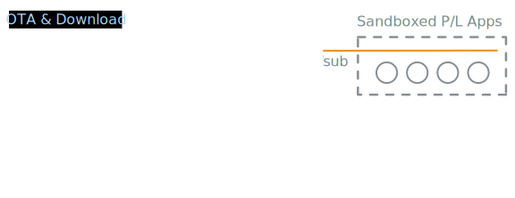

# AkiraCCSDS

AkiraCCSDS is a fork of [AkiraOS](https://github.com/ArturR0k3r/AkiraOS).

AkiraOS is a Zephyr-based embedded operating system for microcontrollers that
runs sandboxed WebAssembly applications. The upstream project focuses on keeping
device firmware stable while applications are delivered as isolated `.wasm`
modules that can be installed or updated without reflashing the OS.

AkiraCCSDS keeps that base intact and adds experimental CCSDS telemetry,
telecommand, and file-transfer support under `src/connectivity/ccsds`.

For the base checkout, Zephyr workspace setup, board configuration, and normal
AkiraOS build flow, start with the [AkiraOS documentation](https://docs.akiraos.dev)
and upstream repository. Once AkiraOS builds for your board, or for
`native_sim`, use this fork's `--ccsds` build option to enable the CCSDS work.

## Why This Is Interesting

Default AkiraOS application upload and management flows are HTTP-oriented. That
is convenient for terrestrial development, but it is not how spacecraft are
normally commanded, monitored, or loaded with files.

AkiraCCSDS keeps the useful AkiraOS runtime model, but explores a different
control path: CCSDS telemetry and telecommand for command and control, and CFDP
for file uplink and downlink.

The longer-term integration idea is to connect AkiraOS pub/sub messaging to
ground-side pub/sub protocols such as NATS or MQTT. These systems are often
carried over sockets, but their useful IoT model is still message-oriented:
publish a reading, send a command, forward an event, or deliver a bounded
payload. That maps more naturally to CCSDS Space Packets than raw TCP streams,
because commands, telemetry samples, file segments, and app messages already
have packet boundaries.



This may be simpler than tunneling general IP over CCSDS. Instead of making the
space link pretend to be an IP network, AkiraCCSDS maps application-level
commands, telemetry, files, and messages onto CCSDS services meant for
constrained, delayed, or radio-carried operations.

There are more general space-networking approaches, including Bundle Protocol
and convergence layers over CCSDS links such as USLP. Those are powerful, but
they bring a larger networking stack and operational model. AkiraCCSDS starts
from the smaller embedded case: direct use of CCSDS packet and CFDP services.

Small-satellite protocols such as CSP are also practical for embedded links.
AkiraCCSDS leans toward CCSDS because it is established, standardized,
interoperable, and widely supported by space link tooling and modems. It also
brings a broader operations vocabulary, including TM/TC packetization, time,
security services, and CFDP file delivery. CSP's core is much thinner, so
services such as file transfer, beacons, and operations interfaces are often
proprietary or mission-specific.

## Fork Focus

The CCSDS work in AkiraCCSDS is scoped to embedded, transport-neutral protocol
support:

- CCSDS Space Packet encode/decode helpers.
- TM and TC transfer-frame support.
- CLTU, BCH, Reed-Solomon, CRC-16, and optional randomization primitives.
- APID routing for decoded Space Packets.
- CFDP PDU, checksum, entity, range, and staging support.
- Development shell commands for manually starting and inspecting TM/TC paths.
- Development UDP adapters for TM output and TC input.
- Interfaces that allow CCSDS I/O to be registered through different device
  transports, such as UDP, UART, RF, CAN, BLE, or other board-specific links.

The implementation is intentionally kept in the AkiraOS connectivity layer
rather than redesigning the OS around CCSDS.

## Repository Layout

Key fork-specific files:

| Path | Purpose |
| ---- | ------- |
| `src/connectivity/ccsds/` | CCSDS protocol implementation |
| `src/connectivity/ccsds/USER_MANUAL.md` | Supported CCSDS shell workflows |
| `configs/ccsds.conf` | Opt-in CCSDS Kconfig fragment used by `build.sh --ccsds` |

Upstream AkiraOS documentation remains relevant for the base OS, WASM runtime,
SDK, board support, and general build system:

- [AkiraOS documentation](https://docs.akiraos.dev)
- [Upstream AkiraOS repository](https://github.com/ArturR0k3r/AkiraOS)

## Build

The known target for AkiraCCSDS is:

```text
Board: akiraconsole_esp32s3_procpu
Host: Fedora Linux
Environment: VS Code devcontainer
```

Build the AkiraConsole firmware:

```bash
./build.sh -b akiraconsole
```

Build with CCSDS enabled:

```bash
./build.sh -b akiraconsole --ccsds
```

The `--ccsds` flag applies `configs/ccsds.conf`, which enables CCSDS/CFDP and
uses a UDP-focused test profile that keeps IPv4/UDP available while disabling
HTTP/TCP-oriented services to reduce ESP32-S3 internal DRAM pressure. Core
symbols include:

```text
CONFIG_AKIRA_CCSDS=y
CONFIG_AKIRA_CCSDS_CFDP=y
CONFIG_NET_UDP=y
CONFIG_AKIRA_HTTP_SERVER=n
CONFIG_NET_TCP=n
```

## CCSDS Shell Quick Reference

When CCSDS shell support is enabled, TM output is manually controlled. Booting
the board does not automatically start telemetry.

Basic TM workflow:

```text
ccsds tm init
ccsds tm route info
ccsds tm route set 0 log
ccsds tm route set 7 log
ccsds tm start
ccsds tm status
ccsds tm stop
```

Development UDP TC input treats each received datagram as one complete CLTU:

```text
ccsds tc start udp
ccsds tc status
ccsds tc stop udp
```

See [src/connectivity/ccsds/USER_MANUAL.md](src/connectivity/ccsds/USER_MANUAL.md)
for the supported user-facing CCSDS shell behavior.

## Development Notes

AkiraCCSDS follows the upstream AkiraOS and Zephyr structure. CCSDS changes
should stay narrowly scoped to `src/connectivity/ccsds` and the minimal build
integration needed to compile that feature.

For embedded code in AkiraCCSDS:

- Use assertions for programmer contract violations when callers have no useful
  runtime recovery path.
- Use error returns for recoverable runtime conditions or normal variable input.
- Prefer `void` for functions that do not have meaningful runtime errors to
  report.
- Keep device I/O transport adapters separate from protocol codecs.

## License

AkiraCCSDS retains the upstream AkiraOS licensing and copyright notices. See
[LICENSE](LICENSE) and the upstream project for the original project context.
