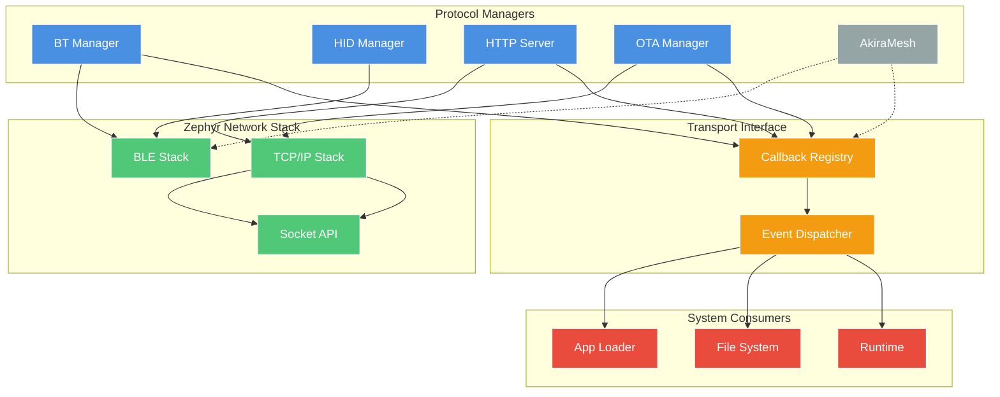
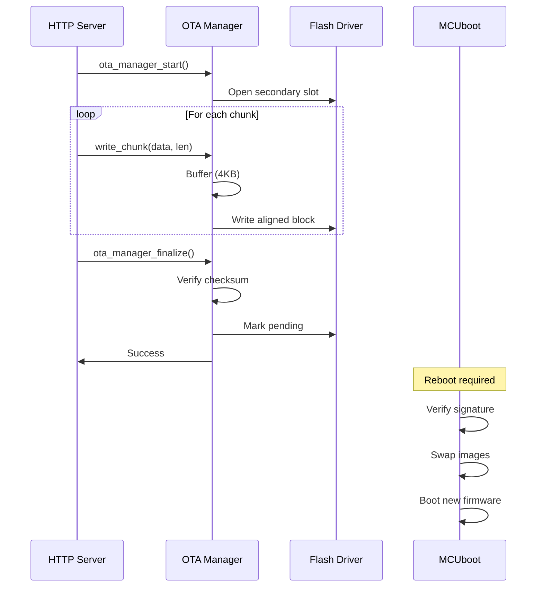

# Connectivity Layer

Modular connectivity subsystem for WiFi, Bluetooth, USB, and OTA operations with a pluggable transport interface.

## Architecture

The connectivity layer provides protocol managers (HTTP, Bluetooth, OTA) that route data to system consumers (Runtime, File System, App Loader) via a callback-based transport interface.

**Key Features:**
- Transport interface for pluggable consumers
- Reduced data copies (2 instead of 4 for OTA)
- Minimal thread overhead (8KB single thread vs. 19KB+ with dedicated threads per component)
- Transports decoupled from consumers via callbacks



## Components

### Transport Interface

Lightweight callback registry for decoupling transport protocols from data consumers.

**API:**
```c
typedef void (*transport_data_cb_t)(const uint8_t *data, size_t len, void *ctx);

int transport_register_handler(enum transport_data_type type, 
                               transport_data_cb_t callback, 
                               void *context);

int transport_notify(enum transport_data_type type, 
                    const uint8_t *data, 
                    size_t len);
```

**Data Types:**
- `TRANSPORT_DATA_WASM_APP` - WebAssembly application
- `TRANSPORT_DATA_FIRMWARE` - OTA firmware update
- `TRANSPORT_DATA_FILE` - Generic file
- `TRANSPORT_DATA_CONFIG` - Configuration data

**Implementation:** Simple array-based registry with O(1) callback lookup. Supports priority-based ordering, handler statistics, and transfer metadata via `transport_chunk_info` struct.

> **Note:** API signatures shown are simplified for clarity. Actual implementation includes additional parameters for chunk metadata, flags (`CHUNK_START`, `CHUNK_END`, `ABORT`), priorities, and statistics tracking.

### HTTP Server (Web Server)

HTTP/1.1 server for file uploads and OTA endpoints. Implemented in `connectivity/ota/web_server.c`.

**Endpoints:**
- `POST /upload` - Multipart file upload to filesystem
- `POST /ota/upload` - Firmware upload to OTA Manager
- `GET /status` - System status JSON
- WebSocket support on port 8081

**Configuration:**
- Thread stack: 8KB
- Max connections: 5 (concurrent)
- Buffer size: 1536 bytes (1.5KB) shared pool
- HTTP port: 8080, WebSocket port: 8081

**Performance:** ~1.3 MB/s upload throughput

### Bluetooth Manager

BLE stack initialization and connection management.

**State Machine:**
```
OFF → INITIALIZING → {ERROR (if bt_enable fails) OR READY} → ADVERTISING → CONNECTED → READY
                                                              ↑__________________|
```

**Operating Modes:**
- `BT_MODE_NONE` - Stack enabled, no service active
- `BT_MODE_HID` - BLE HID profile owns the radio
- `BT_MODE_BLE_APP` - WASM BLE app service owns the radio (mutually exclusive with HID)

**Features:**
- Connection callbacks with reference counting
- Auto-reconnect on disconnect
- GATT service registration
- Thread-safe state management
- Statistics tracking (connections, bytes, RSSI)

### HID Manager

Unified HID device management supporting multiple transports (BLE, USB, Simulation).

**Supported Devices:**
- Keyboard (standard HID keyboard report)
- Mouse (relative/absolute positioning)
- Gamepad (button + axis mapping)

**Architecture:**
- Transport-agnostic coordination layer
- Pluggable transport backends (BLE HID, USB HID)
- Device type selection at runtime via bitmask
- Event-based input delivery to Runtime

**Transports:**
- **BT HID** (`bluetooth/bt_hid.c`) - BLE HID-over-GATT implementation
- **USB HID** (`usb/usb_hid.c`) - USB HID device class
- **Simulation** (`hid/hid_sim.c`) - Testing/debugging backend

### OTA Manager

Firmware update orchestration with MCUboot integration.

**Update Flow:**


**Characteristics:**
- Direct flash writes (no message queue overhead)
- 2 data copies (reduced from 4)
- <10 s completion time for 1.1 MB firmware
- Configurable socket receive timeout (no hard 120 s limit)

### App Loader

Receives WASM applications from network transports.

**Data Sources:**
- HTTP multipart upload
- Bluetooth file transfer
- AkiraMesh distribution (future)

**Flow:**

**HTTP/BLE Upload Flow:** Transport → App Manager → File System → Flash Storage  
**Direct Memory Load:** Transport → App Loader → Runtime (bypasses filesystem)

---

### BLE App Transfer Protocol

The BLE App Transfer service (`src/connectivity/bluetooth/bt_app_transfer.c`) is a system-level GATT service that lets a BLE peer install a WASM application wirelessly without a USB cable or network connection. It is always active when Bluetooth is initialized.

**Service Characteristics:**

| Characteristic | UUID | Access | Purpose |
|----------------|------|--------|---------|
| `RX_DATA` | custom | Write without response | Receives raw WASM data chunks |
| `TX_STATUS` | custom | Notify | Status updates to the BLE peer |
| `CONTROL` | custom | Write | Transfer control commands |

**State machine:**

```
IDLE ──(CMD_START)──► RECEIVING ──(CMD_COMMIT)──► VALIDATING ──► INSTALLING ──► COMPLETE
  ▲                       │                             │              │
  └──────────(CMD_ABORT)──┘                         CRC fail       Install fail
                                                        │              │
                                                        └──────────────► ERROR
```

**Control commands** (written to the `CONTROL` characteristic):

| Value | Constant | Description |
|-------|----------|-------------|
| `0x01` | `CMD_START` | Begin a new transfer. Payload: `name[32] + total_size[4] + expected_crc32[4]` (40 bytes) |
| `0x02` | `CMD_ABORT` | Cancel the current transfer and discard buffered data |
| `0x03` | `CMD_COMMIT` | Finalize transfer; triggers CRC32 validation and installation |
| `0x04` | `CMD_STATUS` | Request an immediate status notification |

**Status codes** (notified via `TX_STATUS`):

| Value | Constant | Description |
|-------|----------|-------------|
| `0x00` | `BT_APP_STATUS_OK` | Success / ready |
| `0x01` | `BT_APP_STATUS_ERROR` | General error |
| `0x02` | `BT_APP_STATUS_BUSY` | Transfer already in progress |
| `0x03` | `BT_APP_STATUS_CRC_FAIL` | CRC32 mismatch — data corrupted |
| `0x04` | `BT_APP_STATUS_SIZE_ERROR` | Received bytes ≠ declared total size |
| `0x05` | `BT_APP_STATUS_INSTALL_FAIL` | App manager rejected the WASM binary |
| `0x06` | `BT_APP_STATUS_NO_SPACE` | Not enough flash space |

**Transfer flow (client-side pseudocode):**

```python
# 1. Send START with header
header = name_bytes(32) + struct.pack("<II", total_size, crc32(wasm_data))
write_characteristic(CONTROL, bytes([0x01]) + header)

# 2. Stream chunks via RX_DATA (no response needed)
CHUNK = 244  # BLE 5.0 MTU minus ATT overhead
for offset in range(0, len(wasm_data), CHUNK):
    write_without_response(RX_DATA, wasm_data[offset:offset+CHUNK])

# 3. Commit — triggers validation + installation
write_characteristic(CONTROL, bytes([0x03]))

# 4. Wait for STATUS_OK notification
status = await_notify(TX_STATUS)
assert status == 0x00
```

**Querying transfer progress** (native C only — not exposed to WASM):

```c
#include "bt_app_transfer.h"

struct bt_app_xfer_progress p;
bt_app_transfer_get_progress(&p);
printf("State: %d, received %u / %u bytes (%u%%)",
       p.state, p.received_bytes, p.total_size, p.percent_complete);
```

> **Note:** This service is a system-level feature. WASM apps cannot initiate or observe BLE transfer sessions directly. Use `app_get_status()` from the Lifecycle API to check whether a newly-transferred app has been installed.

---

### Radio Abstraction Layer (RAL)

Hardware-agnostic radio management system providing unified access to all wireless hardware. Implemented, but layer is in active work in progress stage.

**Supported Radio Types:**
- `RADIO_TYPE_WIFI` - WiFi (2.4GHz/5GHz)
- `RADIO_TYPE_BLE` - Bluetooth Low Energy
- `RADIO_TYPE_802154` - IEEE 802.15.4
- `RADIO_TYPE_LORA` - LoRa/LoRaWAN

**Registry:**
- Central registration for up to 8 radio handles
- Type-based lookup: `radio_manager_get(type)`
- Capability flags and state management
- Thread-safe with mutex protection

**Radio States:**
```
OFF → IDLE → RX/TX/SCAN → SLEEP
```

**Usage:**
- Thread Manager uses 802.15.4 radio
- Matter Manager selects WiFi/Thread/BLE transport
- AkiraMesh selects BLE/802.15.4/ESP-NOW

---

### Thread Manager

OpenThread mesh networking support for Thread-based IoT networks.

**Configuration:**
- Network name and credentials
- PAN ID and channel selection
- Commissioner/Joiner roles

**Roles:**
- `THREAD_ROLE_DISABLED` - Not active
- `THREAD_ROLE_DETACHED` - Not joined to network
- `THREAD_ROLE_CHILD`, `THREAD_ROLE_ROUTER`, `THREAD_ROLE_LEADER`

**Status:** Foundation implementation, requires OpenThread module in `west.yml`

---

### Matter Manager

Matter/CHIP protocol support for smart home interoperability.

**Transport Support:**
- `MATTER_TRANSPORT_WIFI` - Matter over WiFi
- `MATTER_TRANSPORT_THREAD` - Matter over Thread (802.15.4)
- `MATTER_TRANSPORT_BLE` - BLE for commissioning only

**Commissioning:**
- QR code and manual pairing code support
- BLE-assisted setup
- Commissioning timeout handling

**Device Types:**
- Vendor ID, Product ID configuration
- Device type and discriminator

**Status:** Foundation implementation, requires ConnectedHomeOverIP module

---

### Net Stream

Zero-copy TCP/UDP streaming API for WASM applications using shared-memory ring buffers.

**Architecture:**
- Ring buffers live in WASM linear memory
- TX ring: WASM writes, poll thread drains via `zsock_send()`
- RX ring: Poll thread fills from `zsock_recv()`, WASM reads
- No syscall per packet - only on flush/event polling

**Ring Buffer Layout:**
```
Offset  0: write_idx (u32)
Offset  4: read_idx (u32)
Offset  8: capacity (u32)
Offset 12: flags (u32)
Offset 16: data area (framed messages: [len_lo][len_hi][payload])
```

**Socket Types:**
- `NET_TYPE_TCP` - TCP stream
- `NET_TYPE_UDP` - UDP datagram

**Events:**
- `NET_EVT_CONNECTED`, `NET_EVT_DISCONNECTED`
- `NET_EVT_DATA_READY`, `NET_EVT_ACCEPT`, `NET_EVT_ERROR`

---

### WebSocket Client

WebSocket client for real-time bidirectional communication with cloud services.

**Configuration:**
- URL support: `ws://` or `wss://` (secure)
- Subprotocol negotiation
- Auto-ping and auto-reconnect
- Configurable timeouts

**Message Types:**
- `WS_MSG_TEXT` - UTF-8 text frames
- `WS_MSG_BINARY` - Binary data frames
- `WS_MSG_PING/PONG` - Keep-alive

**Features:**
- Up to 4 concurrent connections
- 2KB RX/TX buffers per connection
- Event-driven callbacks
- Connection state management

---

### BLE App Service

Dynamic GATT service layer enabling WASM apps to create custom BLE services at runtime.

**Service Pool:**
- Fixed-size service and characteristic slots
- Runtime allocation via `ble_app_svc_alloc(uuid)`
- Characteristic properties: `BLE_PROP_READ|WRITE|NOTIFY|INDICATE`

**Event Queue:**
- `BLE_EVT_CONNECTED`, `BLE_EVT_DISCONNECTED`
- `BLE_EVT_CHAR_WRITTEN` - includes characteristic handle and value

**Mode Locking:**
- Only one WASM app can hold `BT_MODE_BLE_APP` at a time
- Mutually exclusive with `BT_MODE_HID`

**Typical Usage Flow:**

A WASM application creates custom GATT services by following this sequence:

1. **Initialize BLE layer** — Claim the BLE radio for the app and prepare the service/characteristic pools
2. **Create service structure** — Allocate a service slot with a custom 128-bit UUID
3. **Define characteristics** — Allocate one or more characteristic slots, each with its own UUID, access properties (read/write/notify), and maximum data length
4. **Attach characteristics to service** — Link allocated characteristics to the parent service
5. **Register service** — Commit the service definition to the Zephyr GATT stack, making it visible to BLE peers
6. **Runtime I/O** — Handle connection events, read/write characteristic values, and send notifications during app execution
7. **Cleanup** — Release the BLE radio when the app terminates or switches modes

For the complete WASM API with function signatures, event types, and working examples, see [BLE API](../../AkiraSDK/docs/API_REFERENCE.md#ble-api) in the AkiraSDK documentation.

---

### CoAP Client

The CoAP client (`src/connectivity/client/coap_client.c`) is a native-side protocol implementation designed for IoT cloud integration and LwM2M targets. It supports Confirmable (CON) and Non-Confirmable (NON) message types, block transfer for large payloads, and CoAP Observe for server-push notifications.

> **Note:** CoAP is a native-C facility used by system services and the Cloud Client wrapper. WASM apps use the [Network API](../../AkiraSDK/docs/API_REFERENCE.md#network-api) for TCP/UDP. If you need CoAP from a WASM app, connect over a raw UDP socket.

**Supported Methods:** `GET`, `POST`, `PUT`, `DELETE`

**Content Formats** (select via `coap_content_format_t`):

| Constant | Value | Description |
|----------|-------|-------------|
| `COAP_FORMAT_TEXT_PLAIN` | 0 | Plain text |
| `COAP_FORMAT_JSON` | 50 | JSON |
| `COAP_FORMAT_CBOR` | 60 | CBOR |
| `COAP_FORMAT_SENML_JSON` | 110 | SenML+JSON |
| `COAP_FORMAT_SENML_CBOR` | 112 | SenML+CBOR |

**Basic request API:**

```c
#include "coap_client.h"

// Initialize once at system start
coap_client_init();

// GET a resource
coap_response_t resp;
int rc = coap_client_get("coap://192.168.1.10/sensors/temp", &resp);
if (rc == 0 && resp.code == COAP_CODE_CONTENT) {
    printf("Data: %.*s\n", (int)resp.payload_len, resp.payload);
    coap_client_free_response(&resp);
}

// POST sensor data as JSON
const char *payload = "{\"temp\":23.5}";
coap_client_post("coap://iot.example.com/data",
                 (uint8_t *)payload, strlen(payload),
                 COAP_FORMAT_JSON, &resp);
coap_client_free_response(&resp);
```

**Advanced — full request builder:**

```c
coap_request_t req = {
    .url         = "coap://192.168.1.10/actuator/led",
    .method      = COAP_METHOD_PUT,
    .type        = COAP_TYPE_CON,       // Confirmable — retransmit until ACK
    .format      = COAP_FORMAT_CBOR,
    .payload     = cbor_buf,
    .payload_len = cbor_len,
    .timeout_ms  = 5000,
};
coap_response_t resp;
coap_client_request(&req, &resp);
```

**Observe (server-push notifications):**

```c
// Subscribe to a resource — callback fires on each update
coap_observe_handle_t h = coap_client_observe(
    "coap://iot.example.com/alerts",
    on_alert_received,   // coap_observe_cb_t
    NULL);

// ... later, to unsubscribe:
coap_client_observe_stop(h);
```

**Block transfer for large resources:**

```c
// Download a file > 1 KB automatically split into Block2 transfers
uint8_t buf[8192];
size_t received;
coap_client_download("coap://server/firmware/ota.bin",
                     buf, sizeof(buf), &received);

// Upload large payload with Block1 transfers
coap_client_upload("coap://server/models/nn.cbor",
                   model_data, model_len,
                   COAP_FORMAT_CBOR);
```

**Limits (compile-time constants):**

| Constant | Value | Description |
|----------|-------|-------------|
| `COAP_CLIENT_MAX_URL_LEN` | 256 | Max URL length |
| `COAP_CLIENT_MAX_PAYLOAD` | 1024 | Max single-message payload |
| `COAP_CLIENT_MAX_OPTIONS` | 16 | Max CoAP options per message |

---

### USB Manager

USB device stack management using Zephyr 4.3 USB Device Stack Next.

**Device Classes:**
- **USB HID** (`usb/usb_hid.c`) - Keyboard, mouse, gamepad
- **Mass Storage** (`connectivity/storage/usb_storage.c`) - File access and app discovery
- **CDC-ACM** - Console/UART mapping

**State Management:**
```
DISABLED → INITIALIZED → ENABLED → CONFIGURED
```

**Features:**
- Thread-safe state management
- Event callbacks (configured, suspended, resumed, reset)
- Statistics tracking
- Multiple class support

**USB Storage:**
- Mount point: `/usb`
- WASM app scanning from `/usb/apps`
- Auto-install on connection
- Event notifications

### Cloud Client

Unified multi-transport cloud communication client supporting WebSocket, CoAP, MQTT, BLE, and HTTP.

**Transport Types:**
- `CLOUD_TRANSPORT_WEBSOCKET` - Real-time bidirectional
- `CLOUD_TRANSPORT_COAP` - Constrained environments
- `CLOUD_TRANSPORT_MQTT` - Pub/sub messaging
- `CLOUD_TRANSPORT_BLE` - Mobile app (AkiraApp)
- `CLOUD_TRANSPORT_HTTP` - Local web server

**Features:**
- Unified message protocol across all transports
- Message handler registration (up to 8 handlers)
- RX/TX message queues (16 messages each)
- Auto-connect and auto-reconnect
- Authentication support
- Heartbeat mechanism

**Message Sources:**
- Remote cloud servers
- AkiraApp mobile application (Bluetooth)
- Local web interface

**Handlers:**
- `cloud_app_handler` - App downloads and updates
- `cloud_ota_handler` - Firmware OTA polling

### Internal Buffer Pool (`buf_pool.c`)

Simple fixed-size buffer pool for connectivity layer, avoiding Zephyr NET_BUF dependency.

**Configuration:**
- 8 buffers × 1536 bytes = 12KB total pool size
- Semaphore-based allocation
- Mutex-protected management

**API:**
- `akira_buf_alloc(timeout)` - Allocate buffer
- `akira_buf_unref(buf)` - Release buffer
- `akira_buf_pool_stats()` - Query free/total count

**Usage:**
- UART/TCP stream buffering
- HTTP request/response handling
- Reduces heap fragmentation for network I/O

### AkiraMesh

Low-latency mesh networking for inter-device communication. Foundation implementation exists, active work in progress.

**Transport Options:**
- `AKIRA_MESH_TRANSPORT_BLE` - BLE-based mesh
- `AKIRA_MESH_TRANSPORT_802154` - 802.15.4 radio
- `AKIRA_MESH_TRANSPORT_ESPNOW` - ESP-NOW over WiFi

**Features:**
- Multi-transport support via Radio Abstraction Layer
- Node discovery and beacon protocol
- Mesh protocol header with TTL and sequence numbers
- Node registry (up to `AKIRA_MESH_MAX_NODES`)

**Status:** Foundation implementation complete, routing and state sync in progress

---

### SD Card Manager

Native-side SD card manager for mounting external storage and discovering WASM applications from SD media.

> **Note:** This is a native-C system service used by the Shell and Runtime. WASM apps access SD card files through the standard [Storage API](../../AkiraSDK/docs/API_REFERENCE.md#storage-api), which transparently resolves to SD card when mounted (`/SD:`) or falls back to internal LittleFS.

**Mount Points:**
- `/SD:` (FATFS) when `CONFIG_AKIRA_SD_CARD=y`
- `/sd` for manual mounts
- Apps directory: `/SD:/apps` or `/sd/apps`

**Capabilities:**
- **Auto-detection** — Mounts SD card on initialization if present
- **App discovery** — Scans for `.wasm` files in the apps directory
- **Batch installation** — Install all discovered apps with single command
- **State tracking** — Unmounted/mounted/error states with event callbacks
- **Hot-swap support** — Event notifications on card insertion/removal

**Native API:**

```c
// Mount/unmount operations
int sd_manager_mount(void);              // Mount SD card filesystem
int sd_manager_unmount(void);            // Safely unmount SD card
bool sd_manager_is_mounted(void);        // Query mount status

// App discovery and installation
int sd_manager_scan_apps(char names[][32], int max_count);  
                                         // Scan SD:/apps/ for .wasm files
int sd_manager_install_app(const char *name);  
                                         // Install single app by name
int sd_manager_install_all_apps(void);  
                                         // Install all discovered apps

// State management
sd_state_t sd_manager_get_state(void);  // Get current state
void sd_manager_set_callback(sd_event_cb_t cb, void *user_data);  
                                         // Register event callback
```

**Typical Usage (Shell/Native):**

```c
// Initialize and mount
if (sd_manager_mount() == 0) {
    // Scan for apps
    char app_names[8][32];
    int count = sd_manager_scan_apps(app_names, 8);
    
    // Install specific app
    sd_manager_install_app("sensor_logger");
    
    // Or install all at once
    sd_manager_install_all_apps();
}
```

## Data Flow

For detailed end-to-end data flow diagrams showing how connectivity components interact with the file system, runtime, and OTA subsystems, see [Data Flow Architecture](data-flow.md).

**Key connectivity flows:**
- [Application Loading](data-flow.md#application-loading-flow) - Network → Storage → Runtime (2 data copies)
- [Firmware Updates](data-flow.md#firmware-update-flow-ota) - HTTP → OTA Manager → Flash (2 data copies)
- [Bluetooth Data](data-flow.md#bluetooth-data-flow) - BLE → HID Manager → Runtime → WASM
- [Runtime Execution](data-flow.md#runtime-execution-flow) - WASM → Native APIs → Hardware

## Performance Characteristics

| Operation | Throughput | Latency | Context | Memory |
|-----------|------------|---------|---------|--------|
| HTTP Upload | ~1.3 MB/s | N/A | HTTP Server thread | 1.5KB buffer |
| OTA Flash Write | ~200 KB/s | 10-20ms | HTTP Server thread (blocking) | 4KB alignment buffer |
| BLE Transfer | ~10 KB/s | <10ms | Zephyr BLE stack threads | MTU (244B) |
| HID Report | N/A | <5ms | Callback (event) | 64B |

> **Note:** All network operations (HTTP, OTA) run in the HTTP Server thread context. OTA flash writes block the server during erase/program operations.

## Thread Model

| Thread | Stack | Priority | Blocking |
|--------|-------|----------|----------|
| HTTP Server | 8KB | 7 | Accept/recv |

> **Architecture Note:** The connectivity layer uses a callback-based design to minimize thread overhead:
> 
> - **OTA Manager** — No dedicated thread. Runs synchronously in HTTP Server's thread context via direct API calls. Flash writes block the HTTP server thread during updates. See [OTA Update Flow](data-flow.md#firmware-update-flow-ota) for detailed sequence.
> 
> - **BT Manager** — No user-space thread. Uses Zephyr's kernel-managed BLE stack threads for all BLE operations (advertising, connection handling, GATT). Initialized via `SYS_INIT()` at boot. See [Bluetooth State Machine](#bluetooth-manager) above.
> 
> - **HID Manager** — No dedicated thread. Event-based callbacks deliver input to runtime. See [HID Manager](#hid-manager) above.
> 
> For threading model details, see [Runtime Architecture](runtime.md).

## Configuration

**Kconfig Options:**
```
CONFIG_AKIRA_HTTP_SERVER=y
CONFIG_AKIRA_HTTP_PORT=80
CONFIG_AKIRA_OTA_MANAGER=y
CONFIG_AKIRA_BT_MANAGER=y
CONFIG_AKIRA_HID_MANAGER=y
```

## Design Principles

1. **Modularity** - Each protocol is self-contained
2. **Decoupling** - Transport interface separates protocols from consumers
3. **Thread Safety** - Mutex protection for shared state
4. **Performance** - Direct writes, minimal copies
5. **Simplicity** - Array-based registry, no complex dispatch tables

### OTA Transport Layer

Pluggable transport backends for OTA firmware delivery.

**Transports** (`connectivity/ota/transports/`):
- `ota_http.c` - HTTP/HTTPS upload
- `ota_ble.c` - Bluetooth file transfer
- `ota_cloud.c` - Cloud-initiated updates
- `ota_usb.c` - USB-connected updates

**Interface:**
```c
typedef struct ota_transport {
    const char *name;
    int (*start)(void *user_data);
    int (*stop)(void *user_data);
    int (*send_chunk)(const uint8_t *data, size_t len, void *user_data);
    int (*report_progress)(uint8_t percent, void *user_data);
    void *user_data;
} ota_transport_t;
```

**Registration:**
- `ota_manager_register_transport(transport)`
- `ota_manager_unregister_transport(name)`

---

## Planned Improvements

- Zero-copy network streaming to PSRAM
- Concurrent HTTP connections (currently limited to 5)
- AkiraMesh routing and state synchronization
- Full OpenThread integration
- Full Matter SDK integration

## Related Documentation

- [Architecture Overview](index.md)
- [Runtime Architecture](runtime.md)
- [Data Flow](data-flow.md)
- [OTA Updates Guide](../development/ota-updates.md)
