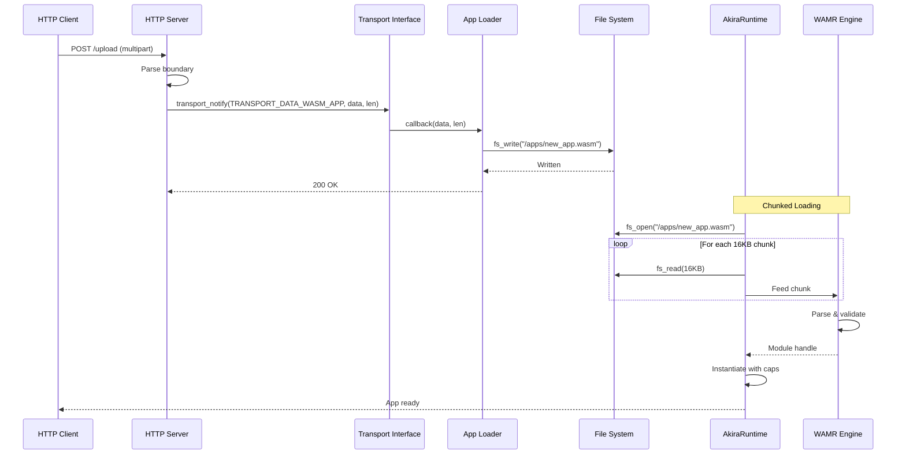
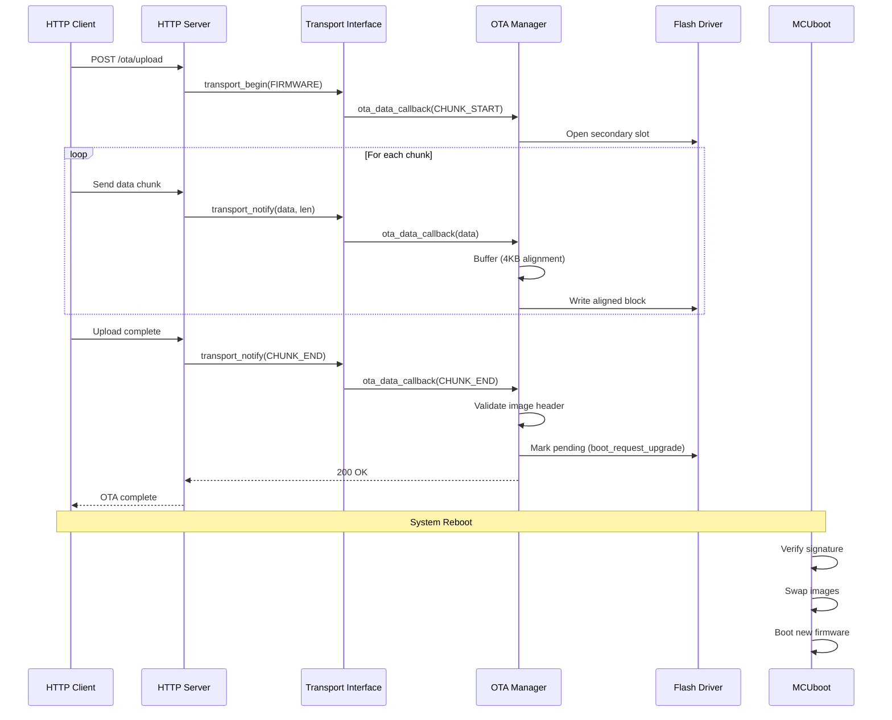
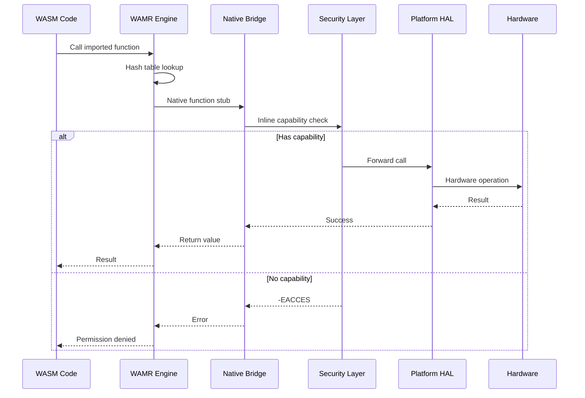
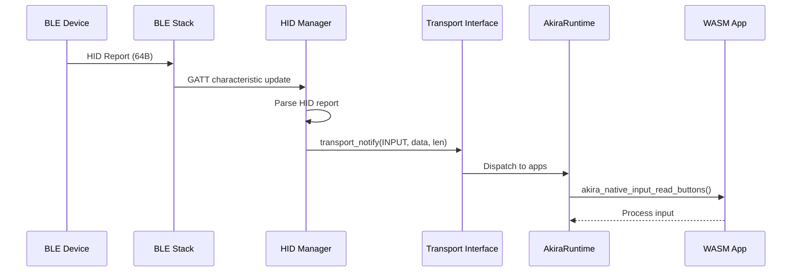
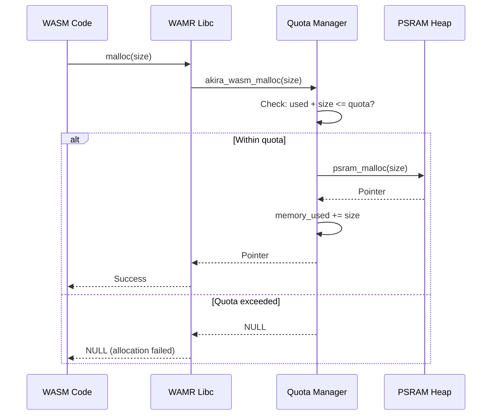
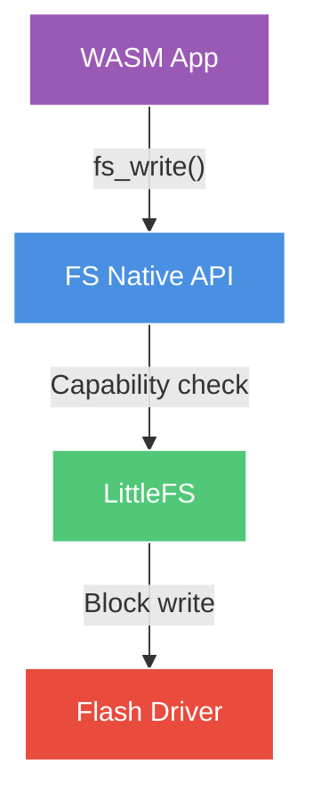

# Data Flow Architecture

End-to-end data flow diagrams showing how information moves through AkiraOS subsystems.

## Overview

Data flows through AkiraOS via three primary paths:
1. **Application Loading** - Network → Storage → Runtime
2. **Firmware Updates** - Network → Flash → MCUboot
3. **Runtime Execution** - WASM → Native APIs → Hardware

## Application Loading Flow

### Network Upload → File System → Runtime



**Data Copies:** 2 (network buffer → HTTP buffer → FS write buffer)

**Memory Usage:**
- HTTP buffer: 1.5KB
- FS write buffer: 4KB (internal)
- Runtime chunk: 16KB (temporary)
- Peak: ~22KB

**Transport Flags:**
- `TRANSPORT_FLAG_CHUNK_START` - Marks first chunk of transfer
- `TRANSPORT_FLAG_CHUNK_END` - Marks final chunk, triggers installation
- `TRANSPORT_FLAG_ABORT` - Cancels transfer, discards data

---

## Firmware Update Flow (OTA)

### Network → Transport → OTA Manager → Flash → MCUboot



**Characteristics:**
- Callback-based via transport interface (no direct HTTP→OTA coupling)
- Direct flash writes (no message queue overhead)
- 4KB alignment buffering
- <10 s for 1.1 MB firmware
- Configurable socket timeout

**Data Copies:** 3 stages (network buffer → HTTP multipart parser → OTA alignment buffer → flash)

**Memory Usage:**
- HTTP buffer: 1.5KB
- OTA alignment buffer: 4KB
- Peak: ~6KB

---

## Runtime Execution Flow

### WASM Application → Native APIs → Hardware



**Performance (estimated):**
- Hash lookup: ~20ns (WAMR native function resolution)
- Capability check: ~10ns (inline bitmask check)
- HAL call: ~30ns (function call overhead)
- **Total overhead:** ~60ns

> **Note:** These are estimated values. Actual performance depends on hardware, compiler optimization, and cache behavior.

---

## Bluetooth Data Flow

### BLE → HID Manager → Runtime → WASM



**Latency:** <5ms from BLE event to WASM callback

---

## Sensor Data Flow

### Sensor → Driver → WASM


**Call Stack:**
```
wasm_app_code()
  └─ akira_native_sensor_read()         [~60ns overhead*]
      └─ platform_sensor_read()          [HAL layer]
          └─ i2c_burst_read()             [Zephyr driver]
              └─ Hardware I2C transaction [~500μs*]
```

> **Note:** Performance metrics marked with * are estimates based on typical embedded system performance. Actual values may vary by hardware and configuration.

---

## Memory Allocation Flow

### WASM malloc → Quota Check → PSRAM



**Quota Configuration:**
- Per-instance heap: 64KB (WAMR default)
- Manifest-defined quota: Configurable per app (no hardcoded maximum)
- Total WAMR heap: 512KB default (configurable)
- Quota enforcement: Atomic tracking in `akira_wasm_malloc/free`

> **Note:** Memory quotas are specified in app manifests via `memory_quota` field. Apps without quotas use WAMR instance heap limits only.

---

## File System Operations

### WASM → FS API → LittleFS → Flash



**Write Path:**
1. `wasm_app_write()` - WASM calls native FS API
2. Capability check - `AKIRA_CAP_STORAGE_WRITE` verified
3. Path sandboxing - Restrict to app-specific paths:
   - `/SD:/apps/<app_name>/` (SD card)
   - `/lfs/apps/<app_name>/` (LittleFS flash)
   - `/ram/apps/<app_name>/` (RAM filesystem)
4. Path traversal protection - Reject ".." sequences
5. LittleFS write - Wear leveling, journaling
6. Flash write - Sector erase + program

**Read Path:** Similar but checks `AKIRA_CAP_STORAGE_READ`

---

## Data Flow Summary

| Flow | Source | Destination | Copies | Peak Memory | Latency |
|------|--------|-------------|--------|-------------|---------|
| **App Upload** | HTTP | File System | 2 | ~22KB | ~200ms (100KB) |
| **OTA Update** | HTTP | Flash | 2 | ~6KB | ~10s (1.1MB) |
| **Native Call** | WASM | Hardware | 0 | N/A | ~60ns* |
| **HID Output** | WASM | BLE Host | 1 | 8-64B | ~5-10ms* |
| **Sensor Read** | I2C | WASM | 1 | ~16B | ~500μs* |
| **File Write** | WASM | Flash | 2 | ~4KB | ~10ms |

> **Note:** Latency values marked with * are estimates. Actual performance varies.

---

## Optimization Opportunities

### Current Bottlenecks
1. **HTTP → FS:** 2 copies (network → HTTP → FS)
2. **WASM Loading:** File-based (need network streaming)
3. **Native Calls:** WAMR hash lookup (~20ns estimated overhead)

### Planned Improvements
- **Zero-copy networking:** Stream directly to PSRAM
- **Static jump table:** Remove hash lookup (<50ns calls estimated)
- **Network streaming:** Load WASM directly from HTTP


---

## Related Documentation

- [Architecture Overview](index.md)
- [Connectivity Layer](connectivity.md)
- [Runtime Architecture](runtime.md)
- [Performance Benchmarks](../resources/performance.md)
