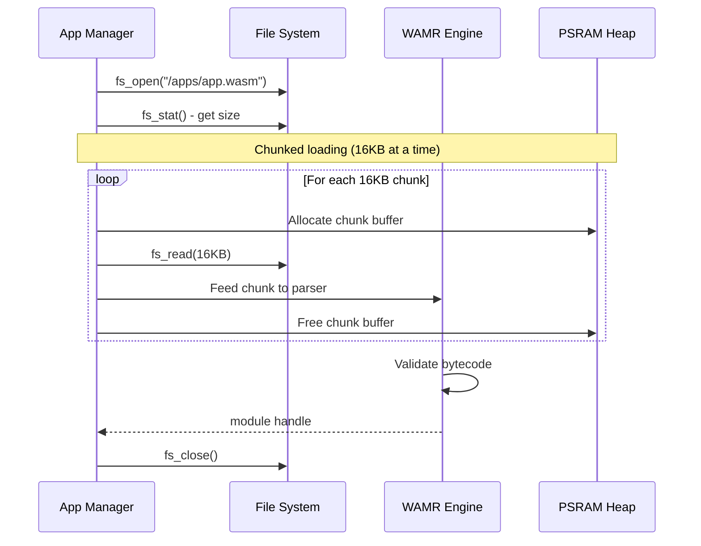
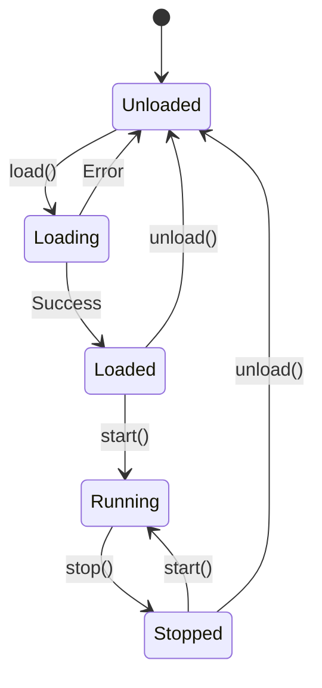

# AkiraRuntime Architecture

**Custom WebAssembly runtime for embedded systems.**

AkiraRuntime is a purpose-built WASM execution environment designed for resource-constrained devices. While it leverages WAMR (WebAssembly Micro Runtime) as the bytecode interpreter and AOT compiler, the runtime architecture—including application management, security model, native API bridge, and memory allocation—is custom-designed for AkiraOS.

## Overview

**Design Goal:** Build a high-performance streaming runtime that rivals native execution while maintaining security isolation.

**Key Features:**
- Chunked file loading (50% less peak memory)
- Inline capability checks (~60 ns overhead)
- Per-app memory quotas (prevents exhaustion)
- Embedded manifest support
- Custom native APIs (not WASI)

```mermaid
graph TB
    classDef app fill:#9B59B6,stroke:#fff,color:#fff
    classDef runtime fill:#4A90E2,stroke:#fff,color:#fff
    classDef security fill:#E94B3C,stroke:#fff,color:#fff
    classDef memory fill:#50C878,stroke:#fff,color:#fff
    classDef improved fill:#f39c12,stroke:#fff,color:#fff

    subgraph Apps ["WASM Applications (Max 8 in separate threads)"]
        APP1[App Instance 1 (Thread)]
        APP2[App Instance 2 (Thread)]
    end

    subgraph Runtime ["Runtime Core"]
        MGR[App Manager]
        LOADER[Chunked Loader]:::improved
        BRIDGE[Native Bridge]
        QUOTA[Memory Quotas]:::improved
    end

    subgraph WAMR ["WAMR Engine"]
        MODULE[Module Parser]
        INST[Instantiator]
        EXEC[Execution Env]
    end

    subgraph Security ["Security Layer"]
        CAP[Inline Cap Check]:::improved
        MANIFEST[Embedded Manifest]:::improved
    end

    subgraph Memory ["Memory Allocation"]
        PSRAM[PSRAM Heap\n256KB Pool]
        SRAM[SRAM Stack]
    end

    FS[(File System)] --> LOADER
    LOADER --> MODULE
    MODULE --> INST
    MANIFEST --> CAP
    CAP --> BRIDGE
    INST --> EXEC
    EXEC --> BRIDGE
    BRIDGE --> API[Native APIs]
    
    APP1 --> MGR
    APP2 --> MGR
    MGR --> LOADER
    MGR --> QUOTA
    
    EXEC -."Linear Memory".-> PSRAM
    EXEC -."Call Stack".-> SRAM
    QUOTA -.-> PSRAM

    class APP1,APP2 app
    class MGR,LOADER,BRIDGE runtime
    class CAP,MANIFEST security
    class PSRAM,SRAM memory
```

## Components

### App Manager

Custom lifecycle orchestrator for WASM applications.

**This is NOT WAMR's app manager**—it's AkiraOS's own implementation that wraps WAMR modules with custom metadata, security policies, and resource management.

**Data Structure:**
```c
typedef struct {
    bool used;
    char name[32];
    wasm_module_t module;         // WAMR module handle
    wasm_module_inst_t instance;  // Instantiated module
    wasm_exec_env_t exec_env;     // Execution environment
    uint8_t status;               // CREATED, RUNNING, EXITED, STOPPED, ERROR
    int8_t exit_code;             // Return code from WASM
    k_tid_t tid;                  // Thread ID
    struct k_sem sem_start;       // Thread synchronization
    struct k_mutex exit_mutex;
    struct k_condvar cond_exit;
    uint32_t cap_mask;            // Capability bitmask
    sandbox_ctx_t sandbox;        // Security sandbox context
    akira_trust_level_t trust_level;
    uint32_t memory_quota;        // Per-app memory limit (from manifest)
    atomic_t memory_used;         // Current usage tracking (atomic)
    runtime_perf_stats_t perf;    // Execution statistics
    uint8_t binary_hash[32];      // SHA-256 for cache validation
    bool hash_valid;
    uint8_t *wasm_binary;         // Binary lifetime management
} akira_managed_app_t;
```

**Operations:**
- `akira_runtime_load_wasm()` - Load WASM from file (chunked)
- `akira_runtime_start()` - Execute main function
- `akira_runtime_stop()` - Terminate execution
- `akira_runtime_destroy()` - Free resources
- `akira_runtime_uninstall()` - Remove app from system

**Status States:**
- **CREATED** - App loaded, not yet running
- **RUNNING** - Actively executing WASM code
- **EXITED** - Completed execution (exit_code set)
- **STOPPED** - Paused by stop() call
- **ERROR** - Runtime error occurred

**Limits:** 8 concurrent app instances default (adequate for embedded use cases). Note that AkiraOS uses a Thread-per-App Polling Model, meaning each application runs in an isolated Zephyr thread. Applications MUST yield control manually within tight loops using `delay()` to prevent system starvation.

### Chunked File Loader

Load WASM binaries from LittleFS with reduced memory footprint.

**Loading Flow:**


**Benefits:**
- 50% less peak memory (16 KB vs entire file in RAM)
- Supports WASM files larger than available RAM
- Predictable memory usage
- Planned: network streaming directly to WAMR

### Native Bridge

Custom native API layer for AkiraOS system access.

**Not WASI:** AkiraRuntime uses custom native functions optimized for embedded peripherals, not POSIX-like WASI interfaces.

**Registered Functions (examples):**
- `akira_native_display_clear()`
- `akira_native_display_pixel()`
- `akira_native_gpio_read()` / `akira_native_gpio_write()`
- `akira_native_rf_send()`
- `akira_native_sensor_read()`
- `akira_native_printf()` - Logging to console
- Plus 100+ additional APIs across 18 modules

**Call Mechanism:**
```
WASM Code
  ↓
extern import call
  ↓
WAMR native lookup (hash table)
  ↓
Native function stub (inline cap check)
  ↓
if (!(cap_mask & CAP_BIT)) return -EACCES;  ← FAST PATH
  ↓
Actual API implementation
```

**Performance:**
- ~60 ns native call overhead
- Inline capability checks (no function call overhead)
- Branch prediction friendly
- Planned: static jump table for <50 ns

### Security Layer

Custom capability-based access control system.

**Capability Bits (23 total):**
```c
// Hardware Access (Bits 0-4)
#define AKIRA_CAP_DISPLAY_WRITE  (1U << 0)
#define AKIRA_CAP_INPUT_READ     (1U << 1)
#define AKIRA_CAP_INPUT_WRITE    (1U << 2)
#define AKIRA_CAP_SENSOR_READ    (1U << 3)
#define AKIRA_CAP_RF_TRANSCEIVE  (1U << 4)

// Communication (Bits 5, 8, 15)
#define AKIRA_CAP_BLE            (1U << 5)
#define AKIRA_CAP_NETWORK        (1U << 8)
#define AKIRA_CAP_HID            (1U << 15)

// Storage (Bits 6-7)
#define AKIRA_CAP_STORAGE_READ   (1U << 6)
#define AKIRA_CAP_STORAGE_WRITE  (1U << 7)

// Peripherals (Bits 9-10, 11-14)
#define AKIRA_CAP_GPIO_READ      (1U << 9)
#define AKIRA_CAP_GPIO_WRITE     (1U << 10)
#define AKIRA_CAP_TIMER          (1U << 11)
#define AKIRA_CAP_UART           (1U << 12)
#define AKIRA_CAP_I2C            (1U << 13)
#define AKIRA_CAP_PWM            (1U << 14)

// System & App Control (Bits 16-22)
#define AKIRA_CAP_APP_CONTROL    (1U << 16)  // Start/stop apps
#define AKIRA_CAP_IPC            (1U << 17)  // Inter-process communication
#define AKIRA_CAP_APP_SWITCH     (1U << 18)  // Switch to another app
#define AKIRA_CAP_MEMORY         (1U << 19)  // Quota-enforced heap allocation
#define AKIRA_CAP_APP_INFO       (1U << 20)  // Read app status/list
#define AKIRA_CAP_POWER_READ     (1U << 21)  // Battery level queries
#define AKIRA_CAP_POWER_CTRL     (1U << 22)  // Sleep mode control
```

**Inline Enforcement:**
```c
// Macro delegates to security subsystem
#define AKIRA_CHECK_CAP_INLINE(exec_env, capability) \
    akira_security_check_exec(exec_env, capability)

// Alternatively, direct macro from akira_api.h:
#define AKIRA_CHECK_CAP_OR_RETURN(exec_env, cap, ret) \
    do { \
        if (!akira_security_check_exec(exec_env, cap)) { \
            return ret; \
        } \
    } while(0)

// Usage in native functions
int akira_native_display_clear(wasm_exec_env_t env, uint32_t color) {
    AKIRA_CHECK_CAP_OR_RETURN(env, AKIRA_CAP_DISPLAY_WRITE, -EACCES);
    return platform_display_clear(color);
}
```

### Inter-Process Communication (IPC)

AkiraRuntime implements a Pub/Sub event messaging system built directly over Zephyr's IPC mechanisms, designed explicitly for exchanging messages between sandboxed WASM applications and the Host OS natively.

**Architecture:**
- **Topic Exchange:** Up to `8` configurable hardware or software topics (`CONFIG_AKIRA_IPC_MAX_TOPICS`)
- **Subscribers:** Max `4` concurrent subscribers per topic
- **Message Size:** Max `256 bytes` per message (`CONFIG_AKIRA_IPC_MSG_MAX_SIZE`)
- **Queue Depth:** `4 messages` per subscription (`CONFIG_AKIRA_IPC_QUEUE_DEPTH`)
- **Memory Routing:** Firing an event across IPC copies payloads from publisher's linear memory into `akira_ipc.c` internal queues, broadcasting to subscriber app instance queues to bypass WAMR sandboxing safely

### Manifest Configuration & Caching Layer

The internal capability sandboxes rely on a rigorous parser bound to `.akira.manifest` files attached to or adjacent to loaded `.wasm` modules.

- **Dynamic Rejection:** If `manifest_parser.c` detects a module requesting a capability beyond the compiled boundaries (or missing digital signatures if `CONFIG_AKIRA_APP_SIGNING=y`), it halts execution prior to memory allocation
- **Runtime Caching:** Utilizing `runtime_cache.c`, AkiraOS avoids constant deep-flash retrievals of bytecode payloads. Successfully validated modules can be optionally cached dynamically onto faster storage or directly in PSRAM based on board availability to heavily trim startup times on application swaps
- **Security Subsystem:** The `src/runtime/security/` subsystem provides sandbox context with syscall filtering, trust level enforcement, app signing/verification, and audit logging
- **Performance Tracking:** Each app instance tracks execution statistics including call count, trap count, timing metrics, and module load timestamps for debugging and optimization

**Embedded Manifest:**
```wasm
;; Custom section embedded in .wasm file
(custom "akira-manifest"
  (name "my_app")
  (version "1.0.0")
  (capabilities "display.write" "input.read" "sensor.read")
  (memory_quota 65536)  ;; 64KB limit
)
```

**Benefits:**
- ~40% faster permission checks (cached capability mask)
- Manifest embedded in WASM (no separate JSON file required)
- Per-app memory quotas
- Note: capability granularity is per-category, not per-resource

### Memory Management

**PSRAM Allocation:**
```c
CONFIG_HEAP_MEM_POOL_SIZE=65536   // 64KB system heap

// Per-app quotas defined in manifest
// Example: memory_quota: 65536  (64KB per app)
// No hardcoded DEFAULT_APP_QUOTA or MAX_APP_QUOTA
```

**Quota Enforcement:**
```c
void *akira_wasm_malloc(size_t size) {
    akira_managed_app_t *app = get_current_app();
    if (app->memory_used + size > app->memory_quota) {
        return NULL;  // Quota exceeded
    }
    void *ptr = psram_malloc(size);
    if (ptr) {
        app->memory_used += size;
    }
    return ptr;
}
```

**Note:** Memory quotas are set per-app via manifest configuration, not compile-time constants. Boards with PSRAM (ESP32-S3) allocate additional heap (e.g., 4MB on AkiraConsole board).

**Memory Layout:**
- WASM module code (after loading)
- WASM linear memory (app heap/stack)
- Native API buffers
- Temporary allocation during load

## WAMR Integration

AkiraRuntime wraps WAMR and provides:

| Component | WAMR Provides | AkiraRuntime Adds |
|-----------|---------------|-------------------|
| Module Loading | Bytecode parsing | Chunked file reading |
| Execution | Interpreter/AOT | Capability enforcement |
| Native Calls | Symbol lookup | Inline permission checks |
| Memory | Linear memory | Per-app quotas |
| Security | Sandboxing | Capability system |

**WAMR Configuration:**
```c
#define WASM_ENABLE_INTERP 1
#define WASM_ENABLE_AOT 1                   // Enabled for Xtensa/ESP32-S3
#define WASM_ENABLE_FAST_INTERP 1
#define WASM_ENABLE_LIBC_BUILTIN 1
#define WASM_ENABLE_LIBC_WASI 0             // Custom APIs instead
```

### Execution Modes

AkiraRuntime supports two execution modes:

**1. Interpreter Mode (.wasm)**
- Universal bytecode execution
- Runs on all platforms
- Baseline performance (1x)
- Default mode for uploaded `.wasm` files

**2. AOT Mode (.aot)**
- Native machine code execution
- 10-50x faster than interpreter
- Architecture-specific binaries
- Requires pre-compilation with `wamrc`
- Currently enabled for ESP32-S3 (Xtensa)

**Hybrid Deployment:**
- Upload both `.wasm` and `.aot` files
- Runtime auto-selects `.aot` if available for current architecture
- Falls back to `.wasm` interpreter otherwise
- Best practice for production apps

See [AOT Compilation Architecture](aot-compilation.md) for detailed guide.

## Performance

| Metric | Value | Target |
|--------|-------|--------|
| Native Call Overhead | ~60ns | <50ns |
| WASM Load Time (100KB) | ~80ms | <50ms |
| Memory Usage (per app) | 64-128KB | Configurable |
| Peak Load Memory | 16KB | Streaming |
| App Switch Latency | <1ms | <500μs |

## Application Lifecycle



**States:**
- **Unloaded:** No resources allocated
- **Loading:** Reading WASM, parsing, validating
- **Loaded:** Module instantiated, ready to run
- **Running:** Executing WASM code
- **Stopped:** Execution paused, resources retained

## Design Principles

1. **Custom Runtime** - Not just a WAMR wrapper; custom lifecycle and security
2. **Streaming First** - Chunked loading, future network streaming
3. **Performance** - Inline checks, minimal overhead
4. **Safety** - Capabilities, quotas, sandboxing
5. **Simplicity** - Fixed app count, straightforward API

## Planned Improvements

- Static native function jump table (<50 ns calls)
- Network streaming to WAMR (skip filesystem round-trip)
- Multi-core WASM execution
- Advanced capability granularity (per-resource limits)

## Related Documentation

- [Architecture Overview](index.md)
- [Security Model](security.md)
- [Native API Reference](../api-reference/native-api.md)
- [Building WASM Apps](../development/building-apps.md)
