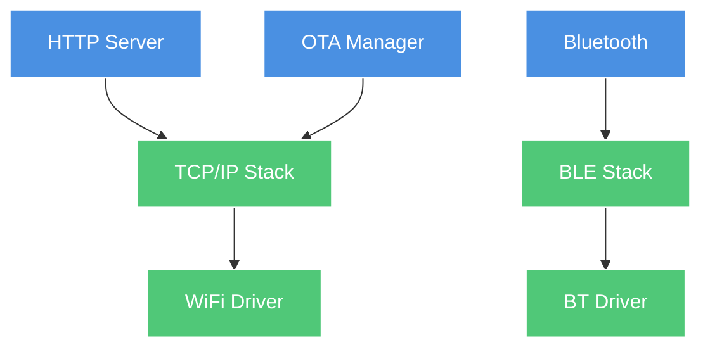

# System Overview

AkiraOS is a high-performance embedded operating system combining **Zephyr RTOS** with **WebAssembly sandboxed execution** for secure, dynamic application deployment on resource-constrained devices.

## System Components

### Hardware Layer
- **Target:** ESP32-S3 (primary), nRF54L15, STM32 (supported)
- **RAM:** 512KB SRAM + 2-8MB PSRAM
- **Flash:** 8-16MB for firmware + apps
- **Peripherals:** SPI, I2C, UART, GPIO, WiFi, Bluetooth

### Kernel Layer (Zephyr RTOS)
- **Scheduler:** Preemptive multitasking with priority queues
- **Network Stack:** TCP/IP, UDP, BLE
- **Drivers:** HAL abstractions for all peripherals
- **File System:** LittleFS on flash partition
- **Boot:** MCUboot for secure boot and OTA updates

### Connectivity Layer
- **HTTP Server:** RESTful API for file/OTA uploads
- **Bluetooth:** BLE stack with HID support
- **OTA Manager:** Firmware update orchestration
- **Transport Interface:** Callback-based data routing
- **AkiraMesh:** Planned mesh networking (v2.0)

### Runtime Layer (AkiraRuntime)
- **App Manager:** WASM lifecycle (load, start, stop, unload)
- **WAMR Engine:** Bytecode interpreter/AOT compiler
- **Security:** Capability-based access control
- **Native Bridge:** WASM↔Native function calls
- **Memory Manager:** PSRAM allocation with quotas

### Application Layer
- **WASM Apps:** Sandboxed user applications (50-200KB)
- **Max Concurrent:** 2 running app instances (default via `CONFIG_AKIRA_APP_MAX_RUNNING`)
- **Max Installed:** 8 apps locally stored (default via `CONFIG_AKIRA_APP_MAX_INSTALLED`)
- **Languages:** C, Rust, AssemblyScript (compiled to WASM)
- **Native APIs:** 18 modules providing hardware and system access - see [AkiraSDK API Reference](../../AkiraSDK/docs/API_REFERENCE.md) for complete API documentation covering BLE, Display, GPIO, HID, I2C, IPC, Lifecycle, Memory, Net (sockets), Power, PWM, RF, Sensors, Storage, Timer, UART, and common utilities

### Additional System Frameworks
- **Settings System (NVS):** Binary non-volatile key-value registry storing system configurations (`settings.c`), optionally encrypted. The storage backend is selectable at runtime: internal flash NVS (`CONFIG_AKIRA_SETTINGS_STORAGE_TYPE_FLASH`), SD card (`CONFIG_AKIRA_SETTINGS_STORAGE_TYPE_SD`), or auto-detected (`CONFIG_AKIRA_SETTINGS_STORAGE_TYPE_AUTO`). Values persist across reboots and can be queried via the shell (`settings get <key>`, `settings set <key> <value>`).
- **Native UI Framework:** Lightweight widget-based embedded windowing system (`ui_framework.c`) handling screens, rendering dirty-states, and widgets. **This is a native C-only framework and is not exported to WASM.** WASM applications interact with the display exclusively through the [Display API](../../AkiraSDK/docs/API_REFERENCE.md#display-api).
- **Interactive Shell (CLI):** Advanced UART debugging console (`akira_shell.c`) with namespaces for Network, Storage, RF, and direct Display testing.
- **Driver Registry:** Dynamic driver registration system (`driver_registry.c`) enabling type-based driver lookup and hot-plugging of hardware components.
- **Error Codes System:** Standardized error code framework (`error_codes.h`) with errno conventions and domain-specific codes (AKIRA_ERR_BASE=1000) for consistent error handling across APIs.
- **Core Libraries:** Integrated utilities including `simple_json` avoiding the need for heavy external parsing payloads.
- **Storage Subsystem:** LittleFS flash partitioning with external SPI/SDMMC SD-Card mounts (`sd_card.c`).

## Thread Model

AkiraOS uses a **Thread-per-App Polling Model** rather than an event-loop system. Each WASM application runs in its own dedicated Zephyr thread and cooperative multitasking is strictly required. Apps must call a yielding function like `delay()` within loops.

| Thread | Stack Size | Priority | Purpose |
|--------|------------|----------|---------|
| Main | 4KB | 5 | App manager, system init |
| App Threads | 8KB (CONFIG_AKIRA_WASM_APP_STACK_SIZE) | 14 | Individual WASM app instances |
| System Workq | 1KB | - | Kernel background work tasks |
| HTTP Server | 4KB | 7 | Network requests |
| OTA/Net Sockets | 4KB | 6 | Firmware updates & Streams |
| BT Manager | 6KB | 7 | Bluetooth operations |
| Network RX | 2KB | 8 | TCP/IP receive poll stack |

## Memory Architecture

The diagram below shows ESP32-S3 DevKitM (primary target). Other boards differ: ESP32 has no PSRAM, ESP32-C3 has 32 KB heap, nRF54L15 has 32 KB heap and no PSRAM.

**Critical Constraint — Thread Stacks:**
WASM thread stacks **MUST** live in internal SRAM, never PSRAM. On ESP32-S3 and similar boards, direct flash write/erase operations (e.g., LittleFS garbage collection) temporarily lock the SPI bus and cache. If a thread's stack is in PSRAM during this window, the CPU cannot read its own stack frames, causing a complete system freeze or hard fault.

```
┌─────────────────────────────────────────────────┐
│ Flash (8MB)                                     │
├─────────────────────────────────────────────────┤
│ MCUboot (64KB)                                  │
│ Primary Slot (3MB)   - Active firmware          │
│ Secondary Slot (3MB) - OTA staging              │
│ FS Partition (2MB)   - Apps + data              │
└─────────────────────────────────────────────────┘

┌─────────────────────────────────────────────────┐
│ SRAM (512KB) — ESP32-S3                         │
├─────────────────────────────────────────────────┤
│ Kernel Heap (64KB)   CONFIG_HEAP_MEM_POOL_SIZE  │
│ Thread Stacks (~64KB)                           │
│ Network Buffers (~32KB)                         │
│ BSS/Data (~128KB)                               │
│ Remaining: available for Zephyr kernel          │
└─────────────────────────────────────────────────┘

┌─────────────────────────────────────────────────┐
│ PSRAM (8MB) — ESP32-S3                          │
├─────────────────────────────────────────────────┤
│ WAMR Heap (1MB)   CONFIG_WAMR_HEAP_SIZE         │
│ App 1 Linear Memory (0-128KB)                   │
│ App 2 Linear Memory (0-128KB)                   │
│ WiFi buffers, fonts, framebuffer                │
│ Remaining free PSRAM                            │
└─────────────────────────────────────────────────┘
```

## Boot Sequence

1. **MCUboot** - Verify primary slot signature
2. **Zephyr Init** - Initialize kernel, drivers, network
3. **FS Mount** - Mount LittleFS partition
4. **Connectivity** - Start HTTP server, BT advertising
5. **Runtime Init** - Initialize WAMR, register native functions
6. **App Manager Ready** - System ready for manual app installation and execution

*Note: Automatic app loading at boot is not currently implemented. Apps must be installed via HTTP/OTA or manually loaded through the runtime API.*

## Network Stack



## Security Architecture

### Sandboxing
- **WASM Isolation:** Memory-safe execution
- **Linear Memory:** Bounded heap (64-128KB per app)
- **No Direct I/O:** All hardware access via native APIs

### Capability Model
- **Permission Bits:** Display, Input, Sensor, RF, FS
- **Manifest:** Embedded in WASM custom section
- **Enforcement:** Inline checks (~60ns overhead)
- **Granularity:** Per-app, not per-resource

### Boot Security
- **MCUboot:** RSA/ECDSA signature verification
- **Rollback Protection:** Version anti-rollback
- **Flash Encryption:** Optional (ESP32-S3)

## File System Layout

```
/lfs/                  # LittleFS (internal flash)
├── apps/              # WASM applications on flash
│   ├── app1.wasm
│   └── app2.wasm
└── data/              # App persistent data (sandboxed per-app)
    ├── app1/
    └── app2/

/SD:/                  # SD card mount (if available)
├── apps/              # WASM applications on SD
└── data/              # SD-based app data

/ram/                  # RAM filesystem (volatile)
└── apps/              # Temporary WASM apps
```

*Note: The system abstracts storage paths - apps access `/apps/` which resolves to the appropriate mount point (`/lfs/apps/`, `/SD:/apps/`, or `/ram/apps/`) based on storage availability and configuration.*

> **System configuration is not stored as files.** WiFi credentials, Bluetooth settings, and other system parameters live in a binary **NVS (Non-Volatile Storage)** key-value registry implemented in `src/settings/settings.c`. There are no `/config/wifi.json` or `/config/bt.json` files on the filesystem.

**Key NVS paths used by the system:**

| Key | Meaning |
|-----|---------|
| `wifi/ssid` | WiFi network name |
| `wifi/psk` | WiFi pre-shared key (PSK) |

Applications read and write these entries via the shell commands (`wifi set`, `wifi get`) or indirectly through system APIs. Values can optionally be encrypted at rest. The storage backend auto-selects between internal flash NVS (`CONFIG_AKIRA_SETTINGS_STORAGE_TYPE_FLASH`) and SD card (`CONFIG_AKIRA_SETTINGS_STORAGE_TYPE_SD`), or detects the best available medium automatically (`CONFIG_AKIRA_SETTINGS_STORAGE_TYPE_AUTO`).

## Power Management

- **Active Mode:** Full speed (240MHz, WiFi on)
- **Light Sleep:** CPU halted, peripherals on
- **Deep Sleep:** Only RTC active (CONFIG_AKIRA_POWER_DEEP_SLEEP - API implemented, board-dependent support)
- **Modem Sleep:** WiFi power save mode

## Real-Time Constraints

*Performance estimates based on ESP32-S3 @ 240MHz. Actual values are board and workload dependent.*

| Operation | Deadline | Actual (estimated) |
|-----------|----------|-----------------|
| HID Input Event | <5ms | ~2ms |
| Display Refresh | <16ms (60fps) | ~10ms |
| Sensor Sampling | <10ms | ~5ms |
| Network RX | <100ms | ~50ms |

## Scalability

| Metric | Current | Theoretical Max |
|--------|---------|-----------------|
| Concurrent Apps | 2 (running) | 8 (memory limited) |
| WASM File Size | 200KB typical | Board-dependent (flash/RAM limited) |
| HTTP Clients | 4 | 4 (CONFIG limit) |
| BLE Connections | 1 | 3 (Zephyr BLE stack limit) |

## Comparison with Alternatives

| Feature | AkiraOS | ESP-IDF | Zephyr | Arduino |
|---------|---------|---------|--------|---------|
| WASM support | Yes (native) | No | Manual | No |
| Security sandbox | Yes (cap-based) | No | No | No |
| OTA updates | Yes (MCUboot) | Yes (custom) | Yes (MCUboot) | Basic |
| Multi-app | Yes (2 instances) | No | No | No |
| Real-time | Yes (Zephyr) | Yes (FreeRTOS) | Yes (native) | Limited |

## Related Documentation

- [Connectivity Architecture](connectivity.md)
- [Runtime Architecture](runtime.md)
- [Security Model](security.md)
- [Data Flow](data-flow.md)
